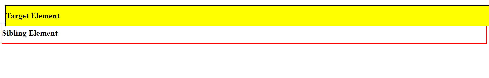
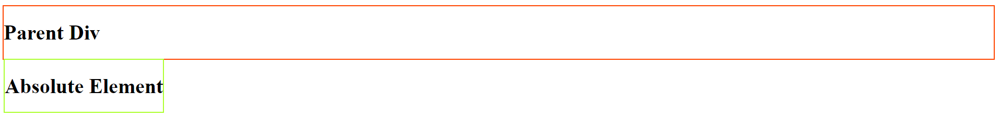
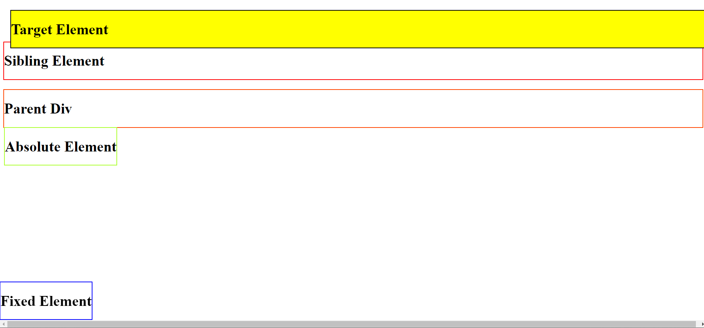
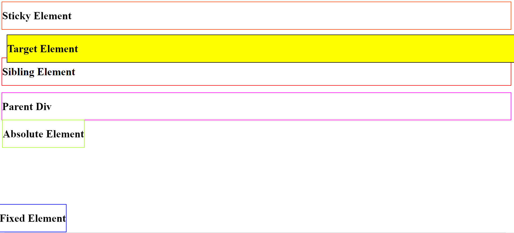

## Relative Positioning: It is relative to it's original position. Giving it left, right, top or bottom will move it with respect to it's original position.

## Static positioning: It is the default position so if do not provide any position property to an element it is static by default

## Absolute positioning: It is positioned relative to nearest ancestor. If there's no ancestor than it assumes body as ancestor and move along with it when we scroll page.

## Fixed Positioning: It is positioned relative to the viewport. It means it stays at the same place even if the page is scrolled.

## Sticky Positioning: IT is positioned based on user scroll position. If the offset point is not met then it is positioned as relative and when the offset point is met then is positioned as fixed.

